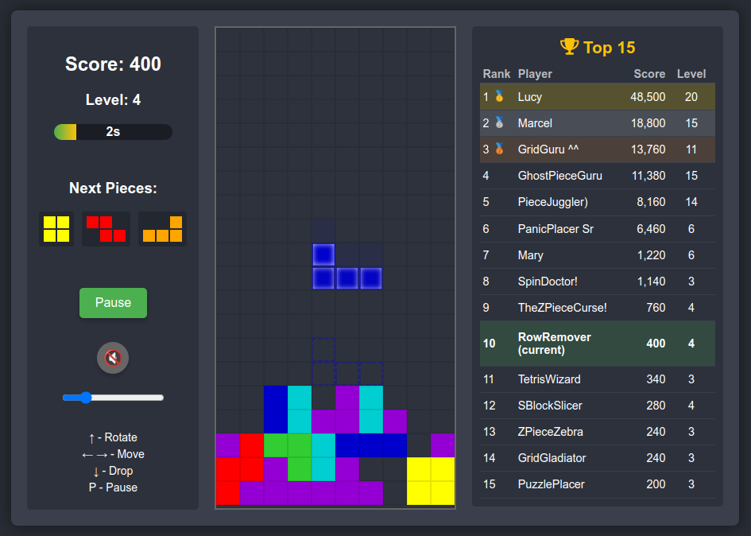

# React Tetris

A modern implementation of the classic Tetris game built with React and TypeScript.

# Play Online

[Try the game online on Vercel](https://tetris-three-gamma.vercel.app/)

## Features

- Classic Tetris gameplay mechanics
- Next tetromino preview (shows 3 upcoming pieces)
- Ghost piece visualization (shows where the piece will land)
- Level progression with timer
- Increasing difficulty as levels progress
- Score tracking based on line clears
- Visual effects for line clears and rotations
- Game pause functionality
- Sound effects with volume control
- Theme music that speeds up with levels
- **Online leaderboard system** with persistent scores stored in MongoDB,
- Backend managing MongoDB database with live scoreboard, deployed on Render.

## Controls

- **Left Arrow**: Move tetromino left
- **Right Arrow**: Move tetromino right
- **Down Arrow**: Soft drop (move down faster)
- **Up Arrow**: Rotate tetromino
- **P**: Pause/Resume game

## Game Elements

- **Board**: Main play area where tetrominoes fall
- **Score**: Points earned by clearing lines
- **Level**: Increases every 15 seconds, speeds up gameplay
- **Next Queue**: Shows the upcoming 3 tetrominoes
- **Leaderboard**: Scores stored in the database

## Scoreboard Features

- Real-time score tracking during gameplay
- Persistent storage of scores in MongoDB
- Top 15 leaderboard display
- Automatic score submission when game ends
- Ability to edit player names after game completion
- Randomized player names
- Visual indicators for player rank changes
- Special highlighting for top 3 scores (gold, silver, bronze)
- Live updates

## How Points are Awarded
Points are awarded when you complete lines during gameplay. The scoring follows this logic:
- Completed 1 line: 40 points * current level
- Completed 2 lines: 100 points * current level
- Completed 3 lines: 300 points * current level
- Completed 4 lines (Tetris): 1200 points * current level

## Technical Implementation

The game is built using:

- React with TypeScript
- Functional components with React Hooks
- RequestAnimationFrame for smooth gameplay
- Custom audio management system
- MongoDB for score persistence
- Axios for API communication
- FontAwesome for UI icons

## Project Structure

- **Components**: Modular UI elements (ScoreAndLevel, NextTetrominoes, Scoreboard, etc.) including relevant styles and types
- **Utils**: Game logic utilities (board operations, tetromino handling, audio management)
- **Hooks**: Game logic hooks (game loop, scoreboard data management, audio settings)
- **Constants**: Game configuration settings
- **Types**: TypeScript type definitions
- **API**: Backend endpoints for score management

## Getting Started

1. Clone the backend/frontend repositories
2. Install dependencies with `npm install`
3. Set up MongoDB database (locally or using MongoDB Atlas)
4. Configure MongoDB connection in server settings
5. Start the backend server with `npm start`
6. Run the game with `npm start`
7. Enjoy playing!

## Backend Requirements

- Node.js server (Express recommended)
- MongoDB database
- API routes for:
  - GET /api/scores - Retrieve top scores
  - POST /api/scores - Save new scores
  - PUT /api/scores/:id - Update player names
